# Local Interconnection Service Protocol

This is a demo repository for the Local Interconnection Service Protocol (LIS Protocol).

The `server` folder contains the code for the example server. This is a `go` project. See the `README.md` file in the
`server` folder for instructions on running it.

The `client` folder contains the code for a sample client. This is an `npm` project. See the `README.md` file in the
`client` folder for instructions on running it.

It's important to note that the demo client and the demo server are meant to be starting points to show the flow of the
protocol and do not handle edge cases adequately.

## Overview

The Local Interconnection Service Protocol (LIS Protocol or LISP) is a protocol to allow Fusion to synchronize context
with LIS solutions running locally. When the case is switched in one application, the change should be reflected in
the other application. The LIS Protocol uses a WebSocket connection to send JSON based messages to allow Fusion and the
LIS to communicate and sync the current context. The protocol will allow either party to request a new context and
accept or reject context change requests. The protocol will also allow the client and server to handle
de-synchronization errors.

The LIS Protocol requires the LIS application to be the server and Fusion will be the client. Only one client can be
synchronized to the server at a time. Multiple clients can be connected to the server and if the synchronized client
disconnects the server can choose to make one of the remaining connected clients the synchronized client. The
synchronized client is the client the LIS application will synchronize context with.

## Message Kinds

The following message types are used to maintain context synchronization:
* `sync-request`
* `sync-accept`
* `sync-reject`
* `ctx-change-request`
* `ctx-change-accept`
* `ctx-change-reject`
* `ctx-null`
* `sync-error`

## Message Structure
* `kind: string` - The kind of message being sent or received. Required for all message types.
* `info` - Required for `sync-request`, `sync-accept`, `sync-reject` messages.
	* `version: number` - The minimum protocol version supported by the application.
	* `application: string` - The name of the application sending the message.
	* `replace_exiting_client: boolean` - Optional. If true then the synchronized client will no longer be synchronized and the requesting client will become the synchronized client.
* `context` - An array of context objects. Required for `sync-accept`, and `ctx-change-request` messages.
	* `key: string` - The context kind.
	* `value: string` - The context value.
* `rejection` - Explains why the request was rejected. Required for `sync-reject`, and `ctx-change-reject` messages.
	* `reason: string` - Why the request was rejected.
	* `status: number` - The HTTP status code for the request rejection.
* `current_context` - The current context. Required for `ctx-change-reject` messages. Can only be used with `ctx-change-reject` messages.
	* `key: string` - The context kind.
	* `value: string` - The context value.
* `error` - For errors that result in de-synchronization. Required for `sync-error` messages.
	* `message: string` - The error message.
	* `status: number` - The HTTP status code for the error.

## Status Codes

| Name              | Value |
|-------------------|-------|
| OK                | 200   |
| BadRequest        | 400   |
| Conflict          | 409   |
| ConflictWithRetry | 419   |
| UpgradeRequired   | 426   |
| TooManyRequests   | 429   |
| ServerError       | 500   |
| Unknown           | 520   |

## Sample Messages


### Sync Request
```JSON
{
  "kind": "sync-request",
  "info": {
    "version": 1,
    "application": "Fusion"
  }
}
```

Sent By the client to the server. The server should never send a `sync-request` message.

### Sync Request with Initial Context
```JSON
{
  "kind": "sync-request",
  "info": {
    "version": 1,
    "application": "Fusion"
  },
  "context": [
    {
      "key": "case",
      "value": "N123456"
    }
  ]
}
```

If the user is already in a case when they initiate context sync send a request with the case as the initial context.
The server should switch to the context sent in this request unless it is unable to do so.

### Sync Accept
```JSON
{
  "kind": "sync-accept",
  "info": {
    "version": 1,
    "application": "LIS"
  }
}
```

Sent by the server to the requesting client if no client is synchronized. Also sent to a client if the synchronized
client's connection is closed, indicating the the client that previously had its `sync-request` rejected is now the
synchronized client. The client should never send a `sync-accept` message.

### Sync Accept with Initial Context
```JSON
{
  "kind": "sync-accept",
  "info": {
    "version": 1,
    "application": "LIS"
  },
  "context": [
    {
      "key": "case",
      "value": "N123456"
    }
  ]
}
```

If the client requested an initial context in the `sync-request` message, the server should include that context
in the `sync-accept` message. If the server is unable to switch to the requested context it should send a `sync-accept` with no context and then send a `ctx-change-request` message to request the desired context.

### Sync Reject
```JSON
{
  "kind": "sync-reject",
  "info": {
    "version": 1,
    "application": "LIS"
  },
  "rejection": {
    "reason": "Client already connected.",
    "status": 409
  }
}
```

Sent by the server to the requesting client if another client is already synchronized. The server can send a status of
`409 (Conflict)` to indicate the client will not later be sent a `sync-accept` and should close the connection. The server
can send a status of `419 (ConflictWithRetry)` to indicate the client may later become the synchronized client and should
keep the connection open. Other status codes can be used to indicate other errors, for instance a `400` status if the
message is malformed or a status in the `500s` for internal errors preventing synchronized. The client should never
send a `sync-reject` message.

### Context Change Request
```JSON
{
  "kind": "ctx-change-request",
  "context": [
    {
      "key": "case",
      "value": "N123456"
    }
  ]
}
```

Sent by either the server or the client to request changing the context.

### Context Change Accepted
```JSON
{
  "kind": "ctx-change-accept",
  "context": [
    {
      "key": "case",
      "value": "N123456"
    }
  ]
}
```

### Context Change Rejected
```JSON
{
  "kind": "ctx-change-reject",
  "current_context": [
    {
      "key": "case",
      "value": "N4567890"
    }
  ],
  "context": [
    {
      "key": "case",
      "value": "N123456"
    }
  ],
  "rejection": {
    "reason": "The doodad field has not been saved."
  }
}
```

Where `current_context` is the current context of the rejector and `context` is the context being rejected.

### Context Change Rejected (Outstanding Request)

If one side has an outstanding request and it receives a new request it should send a `ctx-change-reject` message with
the `rejection.status` set to 409.

```JSON
{
  "kind": "ctx-change-reject",
  "context": [
    {
      "key": "case",
      "value": "N4567890"
    }
  ]
  "context": [
    {
      "key": "case",
      "value": "N123456"
    }
  ],
  "rejection": {
    "reason": "Rejected because of outstanding request.",
	"status": 409
  }
}
```

### Empty Context
```JSON
{
  "kind": "ctx-null"
}
```

Sent when the sender has no current context. As an example the user could navigate from a case to the worklist and no
longer have a context. This would be sent to let the other know the sender is not in sync but there isn't an out of
sync error either.

### Sync Error
```JSON
{
  "kind": "sync-error",
  "context": [
    {
      "key": "case",
      "value": "N123456"
    }
  ],
  "error": {
    "message": "Failed to navigate to N123456",
    "status": 500
  }
}
```

Can be sent by either the server or the client if there is some error that causes a desynchronization before or after the
context has been agreed upon by the server and the client. As an example lets say the both the server and the client have
agreed to switch to a new context and after sending the `ctx-change-accept` message the server fails to switch to the
new context due to an unexpected internal error. The server would send a `sync-error` error and the client could decide
to show an error message to the user and potentially rollback to the previous context to restore synchronization.

## Scenarios

The following scenarios are from the point of view of the client.

### Client connects to server with no initial context:
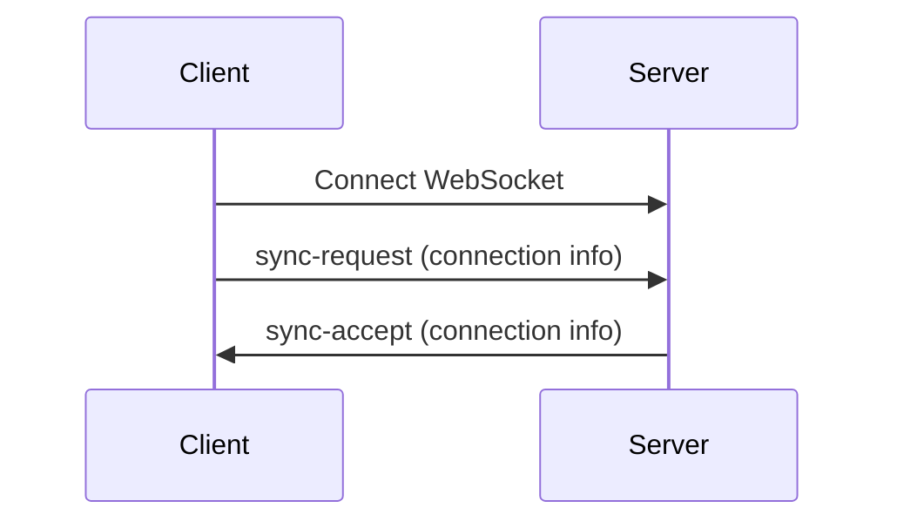

### Client with initial context connects to server:
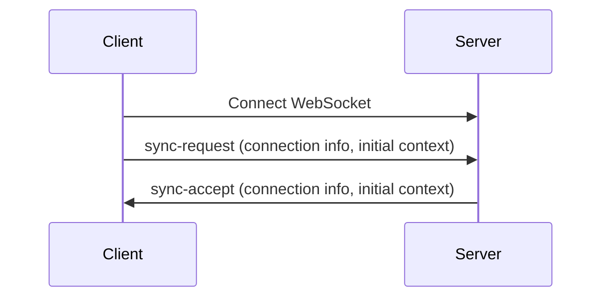

### Client connects to server and accepts new context:
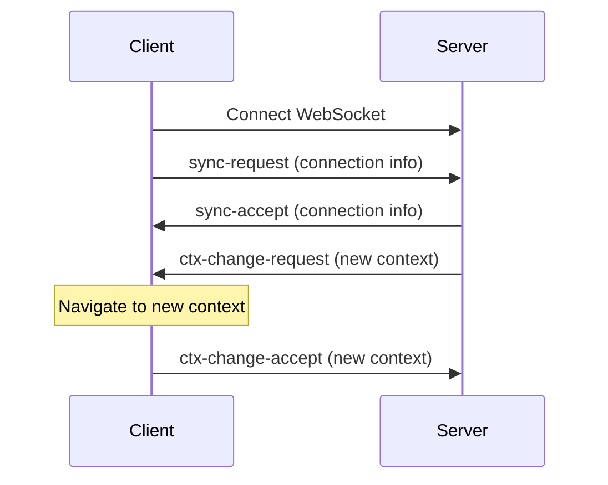

### Client with initial context connects to server and accepts new context:
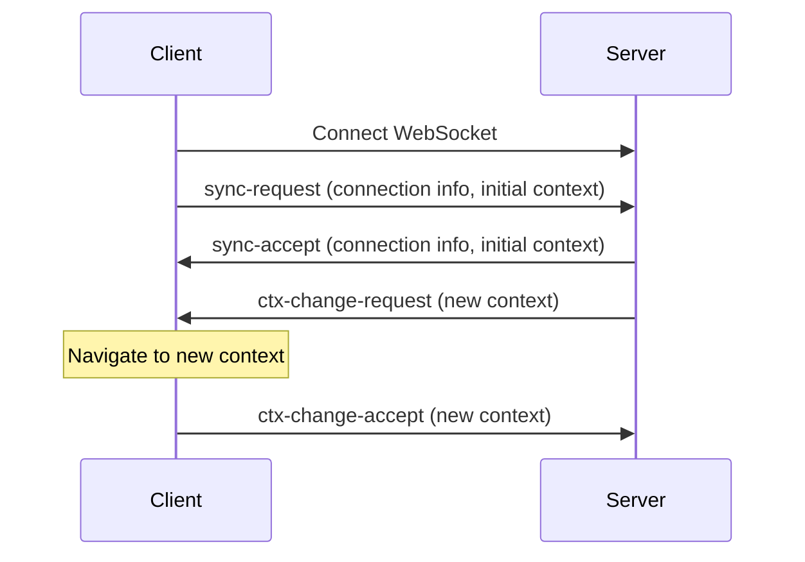

### Client with initial context connects to server, which rejects initial context and requests new context:
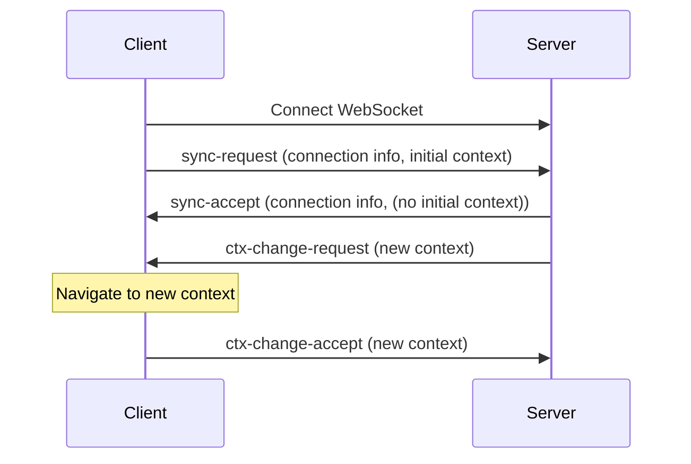

### Client connects to server and fails to navigate to new context:
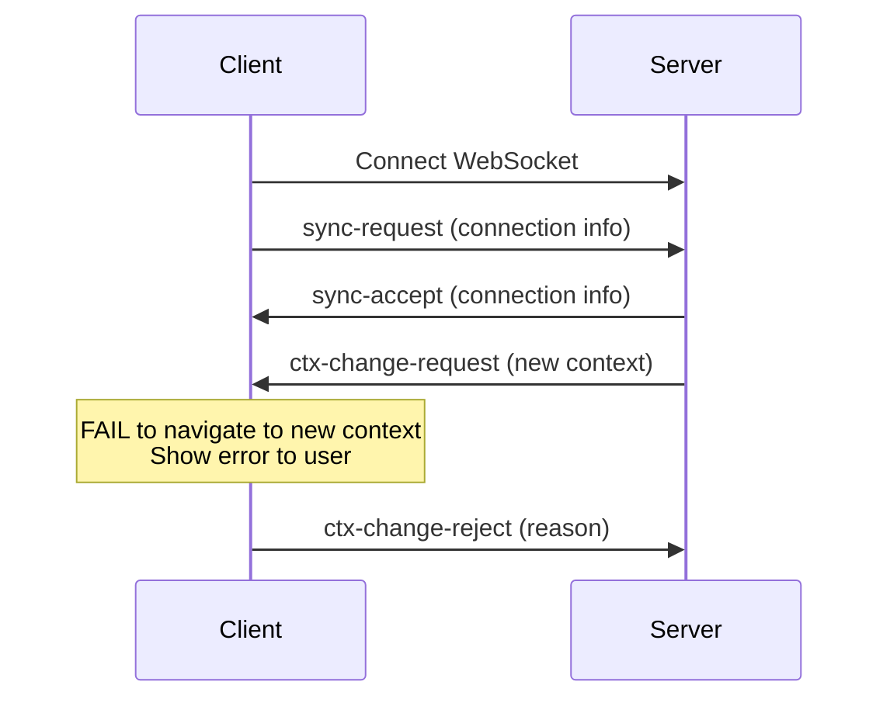

### Client attempts to connect while server has active connection:
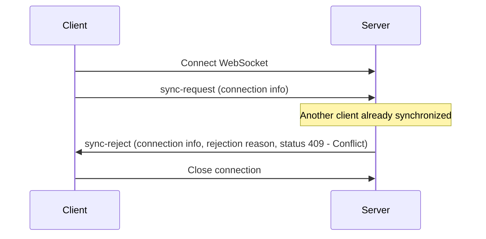

### Client attempts to connect while server has active connection later becomes active connection:
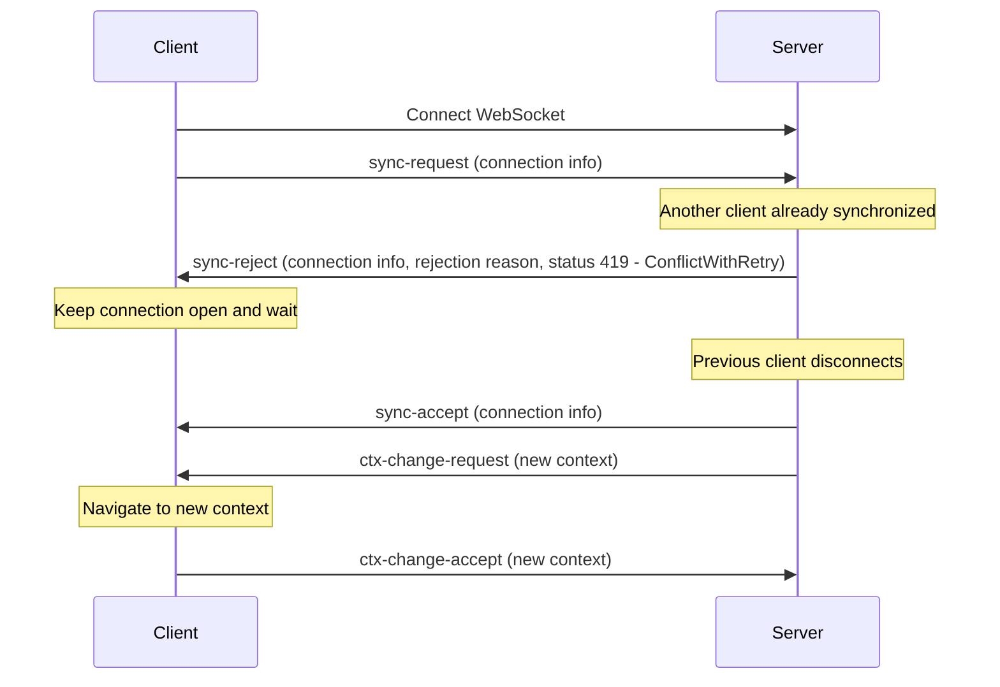

### Client successfully requests context change:
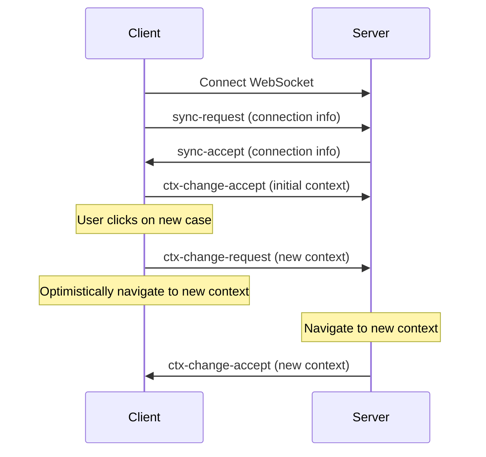

### Server rejects context change request:
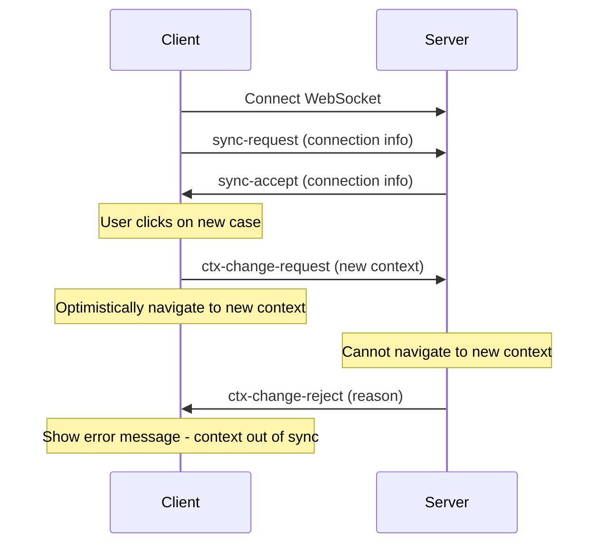

### User navigates from case view to worklist view:
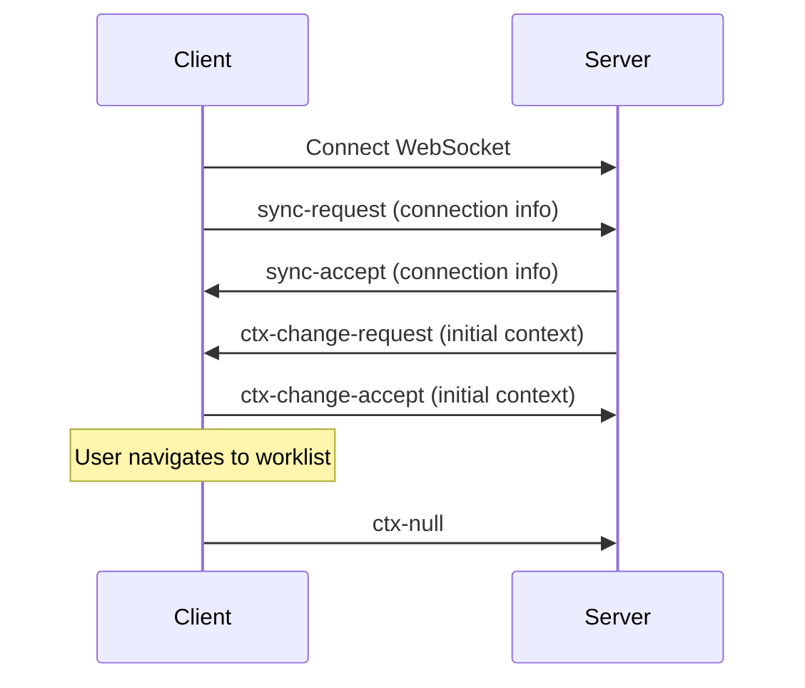

### Server successfully requests context change and fails to switch:
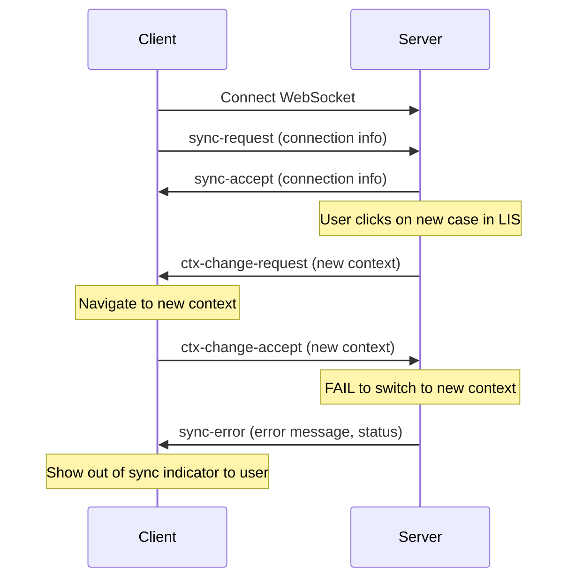

### Receive context change request with outstanding context change request:
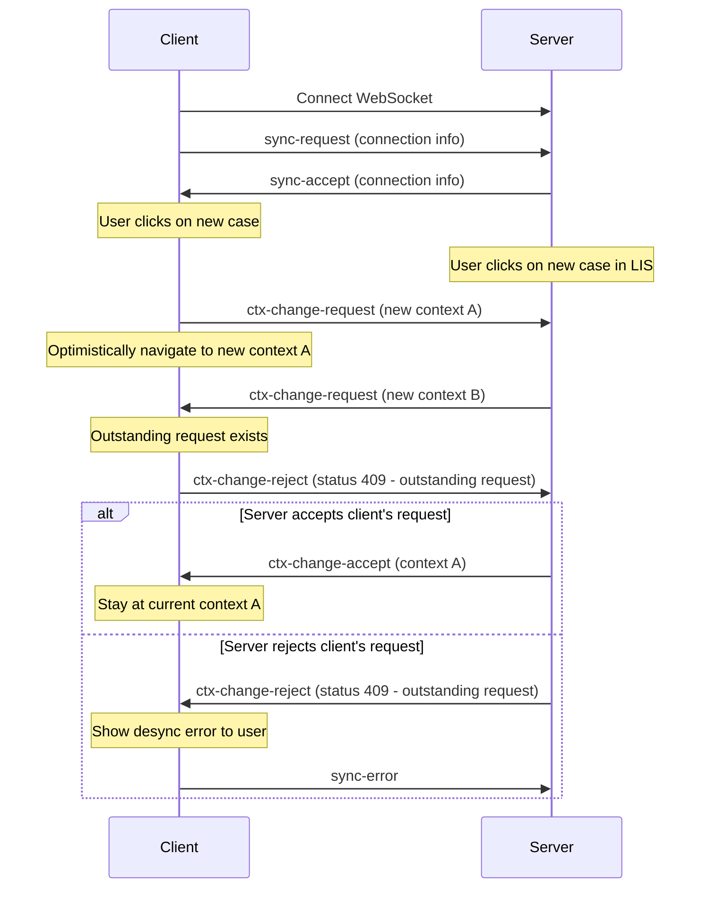
